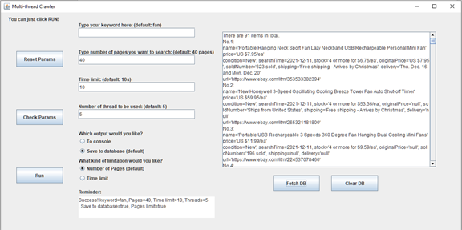
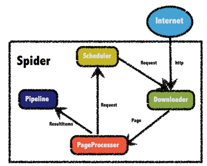

Multi-thread Web Crawler
=========================

## How to run this project

This is a IntelliJ Idea maven project. After downloading it, you need to use IntelliJ Idea import the project and reload the maven(pom.xml) file. Make sure you have maven on your machine. The main class is MyFrame which locate in the path: src/main/java/com/xuchen/crawler. There should be a main method you can run.

The user interface should be like this:

 

## Project structure

I used WebMagic as the crawler framework. In order to connect database, I choose MyBatis as the framework, which can perform MySQL statements. Jsoup is used for processing the web pages.

Here is the structure of this framework:

The class Spider is assembled by these parts: 

Scheduler: decide which page to visit next and whether to visit.

PageProcesser: extract the information from web pages. It’s critical to fetch the correct information we want.

Downloader: download and process the page.

Other part: 

Pipeline: decide how to process the result we get from website; you can choose to store the data somewhere.